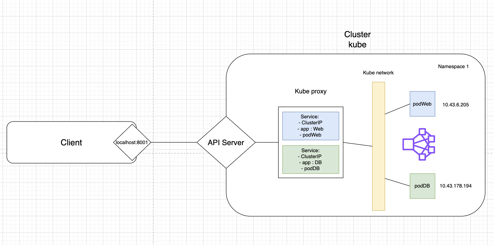

## Question du defis3

1. La différence entre un cluster IP et NodePort est le fait que Nodeport mappe les pods d'un node selon le numero de ports et les pods sont accessible de l'exterieur du cluster. Tandis que ClusterIp permet de mapper une address ip local du cluster a un ou plusieurs pods et de creer une entre dns dans l'entité kubeproxy, les pods seront accessible que localement dans le cluster. 

2. Mon critique vis a vis de l'utilisation d'un pods pour le base de données est la difficulté dans le gestion et de persistence.

3. Le kubedns créer des entrées selon ressource du noms de Service déployé et le label du selector du deployement. L'information propre est le nom du Service deployé.

